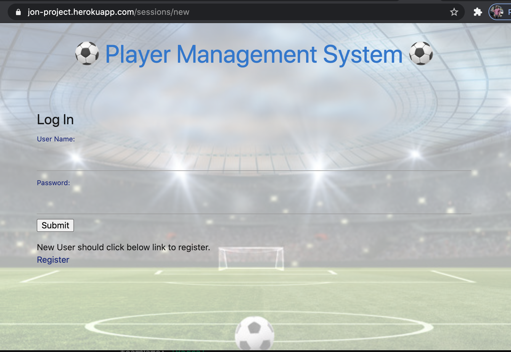
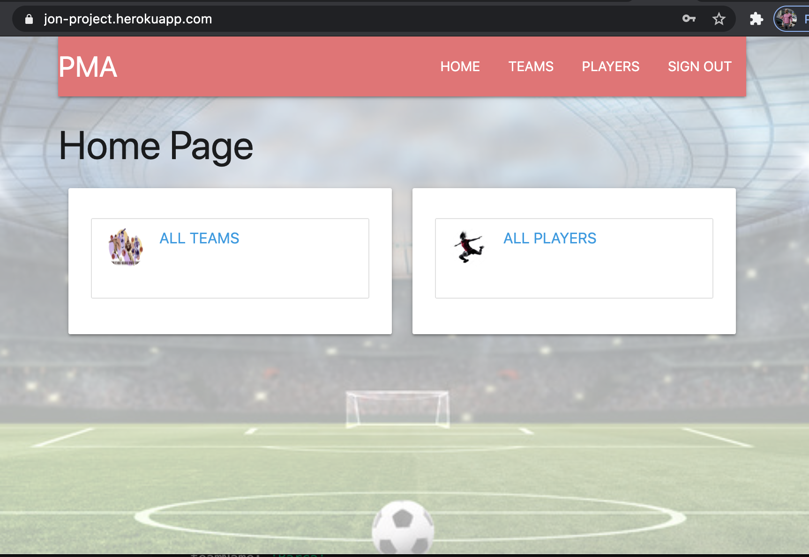
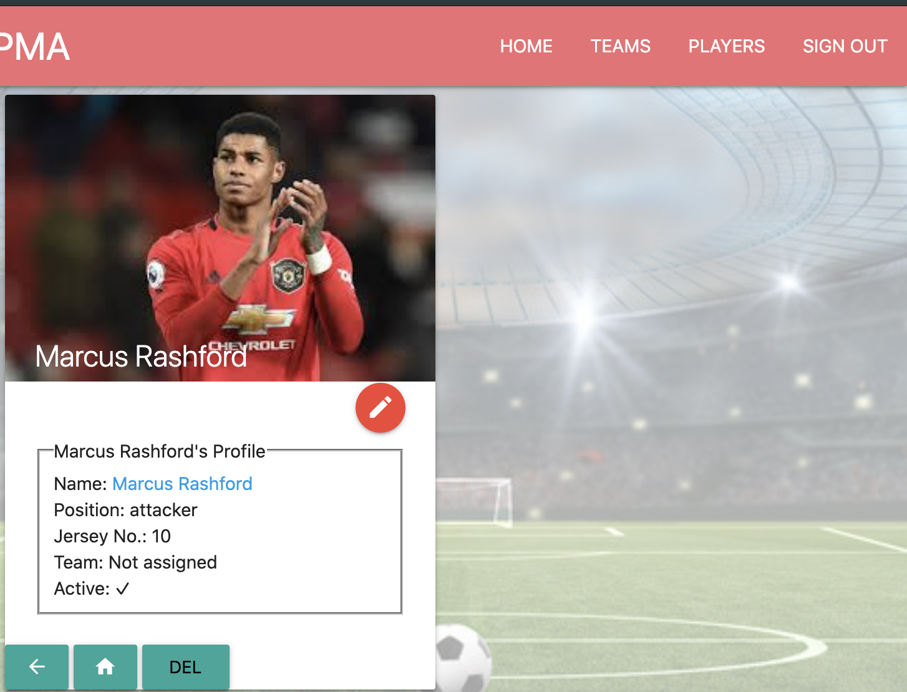

# Project-2: Player Management App

## Project Description 
Player Management System: 
As an avid sports fan (football/soccer), I decided to create a an app that can be used to manage soccer players and teams using Full Stack technologies practiced in class. 

## Project Links:

* [Deployed app:](https://jon-project.herokuapp.com/)

* [Git Repo:](https://github.com/jacheampong/project-2)

* [Wireframe:](https://docs.google.com/drawings/d/1Z3kbVz8Gg1eVVAzaOI4Nu4mLgaJICkg_qlaNHda1oXA/edit)
 

## Screenshots
### Home Page

### Built With: 
* Node.js 
* MongoDB
* Mongoose 
* Express (EJS, Session, Method Override, Dotenv)
* [EJS Partials](https://ejs.co/)
* [bcrypt](https://www.npmjs.com/package/bcrypt)
* [Materialize CSS](https://materializecss.com/)
* Heroku
* HTML
* CSS

### User stories:
* As a new user, I want to be able to register with username and password and use app
* As a registered user, I want to be able to log in and use app
* As a registered user, I want see home page when I log in to app

* As a logged in user, I want to be able to see the available team list
* As a logged in user, I want to be able to create a new team
* As a logged in user, I want to be able to edit/update the team data
* As a logged in user, I want to be able to delete a team from the available team list

* As a logged in user, I want to be able to see the available player list
* As a logged in user, I want to be able to create new players
* As a logged in user, I want to be able to update a player
* As a logged in user, I want to be able to delete a player from the player list

* As a logged in user, I want to be able to log out of the app

### MVP 
### Routes: Players Controller (similar Teams)

| Route Name       	| URL             	| HTTP Verb 	| Description                   | Status     	|
|-------------------|-------------------|---------------|-------------------------------|---------------|
| Index            	| /players          | GET       	| Display a all players         | Completed  	|
| New              	| /players/new      | GET       	| Show form to add new player   | Completed  	|
| Create           	| /players          | POST      	| Create new player 			| Completed  	|
| Show             	| /players/:id      | GET       	| Show player with id           | Completed 	|
| Edit             	| /players/:id/edit | GET       	| Display edit form of player   | Completed  	|
| Update           	| /players/:id      | PUT       	| Update player with id 		| Completed  	|
| Destroy          	| /players/:id      | DELETE    	| Delete player with id 		| Completed  	|

## Stretch Goals
* Include sign up/log in functionality, with encrypted passwords & an authorization flow
* Use EJS Partials
* Include portfolio-quality styling
* Use a CSS framework like Bootstrap, Materialize

## Known Defect
* Remove team name from Player profile when team is deleted

## Future Improvement
* Registration and Login process
* Password recovery
* Improve CSS across application
* Update models and featuews
* Outsource images
* Improve feature and make app applicable to other stops

